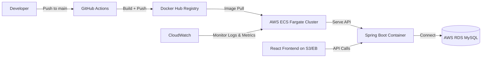

#  FinTrack — Full Stack Personal Finance Tracker

> **Cloud-Native Personal Expense Management System**
> Built with **Spring Boot**, **React**, **MySQL**, **Docker**, and **AWS** — integrating CI/CD, API documentation (Swagger), and real time deployment pipelines.

---

##  Overview

**FinTrack** is a **secure, containerized, and scalable expense tracker** designed for modern cloud environments.
It provides RESTful APIs for expense management, a rich React-based web interface, and automated CI/CD with GitHub Actions and AWS deployment.

---

##  High-Level System Architecture
                          ┌────────────────────────────────────────────┐
                          │              Frontend (React.js)            │
                          │---------------------------------------------│
                          │ - React 18 + Axios + Bootstrap UI           │
                          │ - Provides Dashboard, Login, Analytics      │
                          │ - Interacts with REST APIs (HTTPS JSON)     │
                          │ - Swagger / Postman for API Testing         │
                          └───────────────┬─────────────────────────────┘
                                          │
                                          │  REST API Calls (Axios, HTTPS)
                                          ▼
            ┌────────────────────────────────────────────────────────────┐
            │          Backend (Spring Boot 3.5 / Java 21)               │
            │------------------------------------------------------------│
            │ - Controllers → Services → Repositories (Layered Design)   │
            │ - Authentication & Authorization (Spring Security + JWT)   │
            │ - JPA / Hibernate ORM for DB access                        │
            │ - Exposes Swagger UI docs for API testing                  │
            │ - Logging with SLF4J + Logback                             │
            │ - Runs inside Docker Container                             │
            └───────────────┬────────────────────────────────────────────┘
                            │
                            │  JDBC (Spring Data JPA)
                            ▼
            ┌────────────────────────────────────────────────────────────┐
            │                    Database (MySQL 8.0)                    │
            │------------------------------------------------------------│
            │ - Stores User, Expense, Category data                      │
            │ - Hosted via Docker or AWS RDS                             │
            │ - Auto schema creation using Hibernate DDL auto            │
            └────────────────────────────────────────────────────────────┘
                                          │
                                          ▼
       ┌──────────────────────────────────────────────────────────────────────┐
       │                 Containerization & Orchestration (Docker)             │
       │----------------------------------------------------------------------│
       │ - Dockerfile for Spring Boot build                                   │
       │ - docker-compose.yml for Backend + MySQL setup                       │
       │ - .dockerignore to optimize build context                            │
       │ - Runs multi-stage build (Maven → JAR → Runtime container)           │
       └──────────────────────────────────────────────────────────────────────┘
                                          │
                                          ▼
       ┌──────────────────────────────────────────────────────────────────────┐
       │                CI/CD Pipeline (GitHub Actions + Docker Hub)           │
       │----------------------------------------------------------------------│
       │ - On push to main → Build with Maven                                 │
       │ - Build & Push Docker Image to Docker Hub                            │
       │ - Workflow file: `.github/workflows/docker-build.yml`                │
       │ - Uses secrets: DOCKERHUB_USERNAME & DOCKERHUB_TOKEN                 │
       └──────────────────────────────────────────────────────────────────────┘
                                          │
                                          ▼
       ┌──────────────────────────────────────────────────────────────────────┐
       │                   Cloud Deployment (AWS Elastic Beanstalk / ECS)     │
       │----------------------------------------------------------------------│
       │ - Pulls Docker Image from Docker Hub                                 │
       │ - Deploys containerized app with auto scaling                        │
       │ - Connects to AWS RDS (MySQL) for persistence                        │
       │ - Monitored by AWS CloudWatch                                        │
       │ - HTTPS via AWS Load Balancer                                        │
       └──────────────────────────────────────────────────────────────────────┘
                                          │
                                          ▼
       ┌──────────────────────────────────────────────────────────────────────┐
       │                    Monitoring & Logging (CloudWatch)                 │
       │----------------------------------------------------------------------│
       │ - Application logs streamed from Elastic Beanstalk                   │
       │ - Performance metrics, alarms, and alerts                            │
       └──────────────────────────────────────────────────────────────────────┘

```

---

##  Technology Stack

| Layer                 | Technology                                              | Description                                |
| :-------------------- | :------------------------------------------------------ | :----------------------------------------- |
| **Frontend (UI)**     | React 18, Axios, React Router, Bootstrap                | Responsive web dashboard                   |
| **Backend (API)**     | Spring Boot 3.5, Java 21, Spring Security (JWT), Lombok | RESTful APIs and business logic            |
| **Database**          | MySQL 8.0                                               | Stores users, categories, and expense data |
| **API Documentation** | Swagger UI (Springdoc OpenAPI 2.x)                      | Auto-generated API docs                    |
| **API Testing**       | Postman Collection                                      | Test and validate REST endpoints           |
| **Containerization**  | Docker, Docker Compose                                  | Local and cloud container management       |
| **CI/CD**             | GitHub Actions                                          | Automated build and Docker push pipeline   |
| **Deployment**        | AWS Elastic Beanstalk / ECS Fargate                     | Scalable and managed cloud hosting         |

---

##  Core Features

 **JWT Authentication** (Login / Registration flow)
 **Expense CRUD APIs** (Add, edit, delete, fetch)
 **Category Management** (Budget grouping)
 **Interactive Charts** (React charts for visualization)
 **Swagger API Docs** for real-time endpoint testing
 **Postman Collection** for manual API verification
 **CI/CD** — auto-build and push to Docker Hub
 **AWS Deployment** — Elastic Beanstalk or ECS Fargate

---

##  Detailed System Flow

###  1. Frontend — *React (fintrack-ui)*

* Built with **React 18** and **Axios** to consume backend REST APIs.
* Implements routing using **React Router**.
* Responsive design using **Bootstrap 5**.
* Environment variables configured in `.env` to point to backend API.
* Build output containerized with **Nginx** for cloud deployment.

###  2. Backend — *Spring Boot (fintrack)*

* Java 21 + Spring Boot 3.5
* Modules:

  * `AuthController` → handles login/signup
  * `ExpenseController` → CRUD APIs
  * `UserController` → profile operations
* Security: **Spring Security + JWT Filter**
* Database Layer: **Spring Data JPA + Hibernate**
* Documentation: **Swagger UI** at `/swagger-ui.html`

**Example URLs:**

* Swagger: `http://localhost:8080/swagger-ui/index.html`
* API Docs JSON: `http://localhost:8080/v3/api-docs`

###  3. Database — *MySQL 8.0*

* Auto-created via Docker Compose volume (`fintrack_mysql_data`).
* Configured credentials in `.env` file:

  ```
  MYSQL_DATABASE=fintrack_db
  MYSQL_USER=fintrack
  MYSQL_PASSWORD=fintrack123
  MYSQL_ROOT_PASSWORD=root
  ```

###  4. CI/CD — *GitHub Actions*

Automated build + push pipeline (`.github/workflows/docker-build.yml`):

1. Build backend JAR
2. Build Docker image
3. Push to Docker Hub

**Secrets in GitHub Repository:**

* `DOCKERHUB_USERNAME` → your Docker ID
* `DOCKERHUB_TOKEN` → Docker Hub PAT

###  5. Cloud Deployment — *AWS Elastic Beanstalk / ECS*

#### Option 1: **Elastic Beanstalk (Simple Deployment)**

1. Install EB CLI

   ```bash
   pip install awsebcli
   ```
2. Initialize environment

   ```bash
   eb init
   ```
3. Create and deploy

   ```bash
   eb create fintrack-env
   eb open
   ```

Elastic Beanstalk auto-manages EC2, Load Balancer, and scaling.

#### Option 2: **ECS (Production-Grade Setup)**

* Uses **Docker Hub image** built by GitHub Actions.
* Create Task Definition → Add container image → Set port 8080
* Deploy service on **AWS Fargate** with VPC & Load Balancer.
* Integrate **CloudWatch Logs** for monitoring.

---

##  API Testing and Documentation

###  Swagger UI

Swagger auto-generates documentation for every REST endpoint.

* Accessible via `http://localhost:8080/swagger-ui/index.html`
* Use it to test APIs directly from browser.

###  Postman

A ready-to-import **Postman collection** is provided in `/postman/FinTrack-API-Collection.json`
Includes:

* Auth APIs (Signup, Login)
* Expense APIs (GET, POST, PUT, DELETE)
* Category APIs

Usage:

1. Import collection in Postman
2. Add environment variable `{{base_url}} = http://localhost:8080`
3. Test endpoints with JWT token authentication.

---

##  Local Development Setup

### Step  — Clone Repo

```bash
git clone https://github.com/<your-username>/fintrack.git
cd fintrack
```

### Step 2️ — Build & Run (Docker Compose)

```bash
docker compose up --build
```

### Step 3️ — Access

| Service     | URL                                                                                        |
| :---------- | :----------------------------------------------------------------------------------------- |
| Frontend    | [http://localhost:3000](http://localhost:3000)                                             |
| Backend API | [http://localhost:8080](http://localhost:8080)                                             |
| Swagger UI  | [http://localhost:8080/swagger-ui/index.html](http://localhost:8080/swagger-ui/index.html) |
| MySQL       | localhost:3306                                                                             |

---

##  CI/CD Workflow

Every commit to `main` branch triggers:

1.  Maven clean build
2.  Docker image build
3.  Docker image pushed to Docker Hub
4.  Ready for AWS deployment

This ensures a **zero-manual build pipeline** and keeps images up-to-date for ECS / Beanstalk.

---

##  Cloud Architecture Overview

**High-Level Cloud Flow**



---

##  Tools and Versions

| Tool           | Version | Purpose           |
| -------------- | ------- | ----------------- |
| Java           | 21      | Backend runtime   |
| Maven          | 3.9+    | Build backend     |
| Node           | 18+     | Build frontend    |
| Docker         | Latest  | Containerization  |
| GitHub Actions | v5      | CI/CD             |
| AWS EB / ECS   | Latest  | Cloud hosting     |
| Swagger        | 2.x     | API documentation |
| Postman        | Latest  | API testing       |

---

##  Key Takeaways

 Complete **end-to-end full stack system** (React + Spring Boot + MySQL)
 Integrated **API documentation** via Swagger
 Automated **CI/CD pipeline** to Docker Hub
 **Cloud-native deployment** on AWS ECS / Elastic Beanstalk
 Ready for enterprise-level scalability and monitoring

---

##  Author

Bharath Shiva Sai Teja Madala
💼 Senior Full-Stack Java Developer
📍 New York, NY
🌐 [LinkedIn] | [GitHub]((https://github.com/steja578))

---
